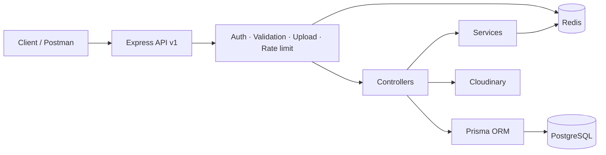
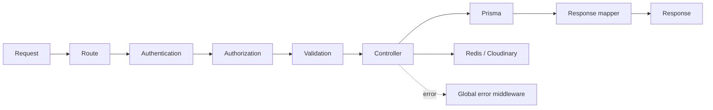

<div align="center">

# Music Streaming API

### Backend API cho nền tảng nghe nhạc trực tuyến

Một dự án học tập tập trung vào thiết kế REST API, xác thực an toàn, phân quyền theo tài nguyên, xử lý media và đảm bảo tính toàn vẹn dữ liệu trong môi trường có nhiều request đồng thời.

<p>
  
  
  
  
</p>

<p>
  
  
  
  
</p>


</div>

---

## Tổng quan

Music Streaming API mô phỏng backend của một nền tảng nghe nhạc: quản lý người dùng, nghệ sĩ, album, bài hát, thể loại, playlist, lượt nghe, yêu thích và theo dõi nghệ sĩ.

Mục tiêu chính của dự án không chỉ là hoàn thành CRUD. Trong quá trình xây dựng, tôi tập trung giải quyết những vấn đề thường gặp trong backend thực tế:

- Phân biệt quyền `User`, `Artist Manager` và `Admin` theo từng tài nguyên.
- Xoay vòng refresh token và ngăn token đã dùng bị phát lại.
- Giới hạn lượt nghe phân tán bằng Redis thay vì bộ nhớ của một process.
- Duy trì thứ tự playlist chính xác khi nhiều request cập nhật đồng thời.
- Kiểm tra nội dung thật của file upload, không chỉ tin vào MIME type.
- Dọn media trên Cloudinary khi request thất bại hoặc tài nguyên được thay thế.
- Xử lý an toàn kiểu `BigInt` khi trả JSON.

## Điểm nổi bật kỹ thuật

| Nhóm | Cách triển khai |
|---|---|
| Authentication | Access token 15 phút, refresh token 7 ngày, secret tách biệt và HttpOnly cookie |
| Token rotation | Refresh token có `jti`, được hash SHA-256 trong Redis và tiêu thụ nguyên tử bằng `GETDEL` |
| Authorization | RBAC kết hợp resource ownership cho artist, album, track và playlist |
| Media security | Multer memory storage, giới hạn dung lượng và kiểm tra magic bytes cho JPEG, PNG, GIF, WebP, MP3, WAV, FLAC |
| Private streaming | Cloudinary authenticated asset và signed URL có thời hạn; hỗ trợ nguồn audio HTTPS bên ngoài |
| Distributed rate limit | Redis `SET NX EX` giới hạn một lượt nghe cho mỗi listener/track trong cửa sổ 30 giây |
| Data integrity | PostgreSQL foreign key, composite key, unique position và Prisma transaction |
| Concurrent playlist updates | Khóa hàng bằng `SELECT ... FOR UPDATE`, ghi vị trí tạm và đánh lại dãy vị trí liên tục |
| Failure recovery | Compensating cleanup xóa Cloudinary asset khi response lỗi hoặc kết nối bị đóng |
| API safety | Validation tập trung, error middleware, pagination có giới hạn và response mapper |

## Kiến trúc hệ thống



Luồng xử lý request được tổ chức theo pipeline:



## Design patterns và kiến thức đã áp dụng

### Layered Architecture

Source code được chia theo trách nhiệm: route định nghĩa HTTP contract, validator kiểm tra input, middleware xử lý cross-cutting concerns, controller điều phối request, service quản lý nghiệp vụ dùng lại và utility chuẩn hóa logic dùng chung. Cấu trúc này quen thuộc với hệ sinh thái Express, dễ tìm kiếm và phù hợp với quy mô hiện tại của dự án.

### Layered Request Pipeline

Express middleware tạo thành chuỗi xử lý có trách nhiệm riêng: xác thực, phân quyền, validation, upload và rate limiting. Controller chỉ được gọi sau khi request vượt qua các lớp bảo vệ cần thiết.

### Service Layer

Vòng đời refresh token được tách khỏi controller thành service riêng. Service chịu trách nhiệm hash, lưu, tiêu thụ và thu hồi token trong Redis.

### Adapter và External Service Boundary

Prisma PostgreSQL adapter tách việc truy cập dữ liệu khỏi HTTP layer. Redis và Cloudinary được đặt sau các lớp config/service/utility riêng để giới hạn sự phụ thuộc của business code vào SDK bên ngoài.

### Response Mapper

Các mapper như `sanitizeUser` và `formatTrack` loại dữ liệu nhạy cảm, chuẩn hóa `BigInt` và duy trì response contract nhất quán.

### Transaction và Compensating Action

- Prisma transaction bảo đảm cập nhật lượt nghe và lịch sử là một đơn vị nguyên tử.
- Playlist dùng transaction kết hợp row lock để tránh race condition.
- Cloudinary cleanup đóng vai trò compensating action khi database operation hoặc HTTP response thất bại.

### Code tour dành cho reviewer

- [API composition](backend/src/routes/index.ts): nơi kết nối các nhóm route và được mount tại `/api/v1`.
- [Authorization middleware](backend/src/middlewares/auth.middleware.ts): RBAC và kiểm tra quyền theo tài nguyên.
- [Playlist concurrency](backend/src/controllers/playlist.controller.ts): transaction, row lock và reindex vị trí.
- [Playback limiter](backend/src/middlewares/playback.middleware.ts): distributed rate limit bằng Redis.
- [Refresh token service](backend/src/services/refresh-token.service.ts): hash, rotation và revoke token.
- [Media lifecycle](backend/src/utils/cloudinary-asset.ts): cleanup asset và failure recovery.
- [Relational data model](backend/prisma/schema.prisma): quan hệ, composite key, index và constraint.

## Chức năng chính

- Đăng ký, đăng nhập, refresh token rotation và đăng xuất.
- Hồ sơ người dùng, avatar và quản trị vai trò.
- Nghệ sĩ, thành viên quản lý và trạng thái xác minh.
- Album có ownership theo nghệ sĩ.
- Track, nghệ sĩ chính/featured, thể loại, lyrics JSON và streaming audio.
- Ghi nhận lượt nghe có rate limit và listening history.
- Playlist công khai/riêng tư, thêm, di chuyển, reorder và tự động reindex.
- Yêu thích bài hát và theo dõi nghệ sĩ.
- Tìm kiếm, lọc, sắp xếp và pagination.

## Cấu trúc dự án

```text
music-app/
├── backend/
│   ├── src/
│   │   ├── config/             # PostgreSQL, Redis, Cloudinary
│   │   ├── controllers/        # Request orchestration và response
│   │   ├── middlewares/        # Auth, upload, rate limit, error handling
│   │   ├── routes/             # REST endpoints, mount tại /api/v1
│   │   ├── services/           # Nghiệp vụ dùng lại và external state
│   │   ├── utils/              # Mapper và helper dùng chung
│   │   ├── validators/         # Body, query và params validation
│   │   ├── app.ts              # Express application
│   │   └── server.ts           # Infrastructure startup
│   ├── prisma/
│   │   ├── migrations/
│   │   └── schema.prisma
│   ├── tests/
│   ├── .env.example
│   ├── package.json
│   └── tsconfig.json
└── README.md
```

## Bắt đầu nhanh

### Yêu cầu

- Node.js và npm
- PostgreSQL
- Redis
- Tài khoản Cloudinary

### Cài đặt

```bash
git clone https://github.com/havanphong784/music-app.git
cd music-app/backend
npm install
cp .env.example .env
```

Cập nhật thông tin PostgreSQL, Redis, JWT và Cloudinary trong `.env`, sau đó chạy:

```bash
npx prisma generate
npx prisma migrate deploy
npm run dev
```

API mặc định hoạt động tại:

```text
http://localhost:5000/api/v1
```

## Kiểm tra chất lượng

```bash
npm run check
```

Lệnh trên thực hiện tuần tự:

1. TypeScript strict typecheck với `tsc --noEmit`.
2. Chạy regression tests bằng Node.js test runner.
3. Kiểm tra tính hợp lệ của Prisma schema.

## Những bài học chính

Qua dự án này, tôi đã thực hành và hiểu rõ hơn về:

- Thiết kế REST API có versioning, layered boundaries và separation of concerns.
- Authentication khác authorization như thế nào trong hệ thống nhiều vai trò.
- Quản lý vòng đời JWT thay vì chỉ phát token và kiểm tra chữ ký.
- Tính nguyên tử, transaction, unique constraint và race condition.
- Khi nào nên dùng PostgreSQL, Redis và object storage trong cùng một hệ thống.
- Bảo vệ upload pipeline và quản lý vòng đời external asset.
- Tổ chức TypeScript backend để có thể mở rộng và kiểm thử.
- Viết migration có thể triển khai trên database mới bằng `prisma migrate deploy`.

## Hướng phát triển tiếp theo

- Bổ sung integration test sử dụng database riêng cho môi trường test.
- Sinh OpenAPI/Swagger documentation từ validation schema.
- Thêm Docker Compose cho PostgreSQL, Redis và backend.
- Thiết lập CI pipeline cho typecheck, test và migration validation.
- Thêm observability: structured logging, metrics và error tracking.

---

<div align="center">
  <strong>Built as a backend engineering learning project with an emphasis on correctness, security and maintainability.</strong>
</div>
